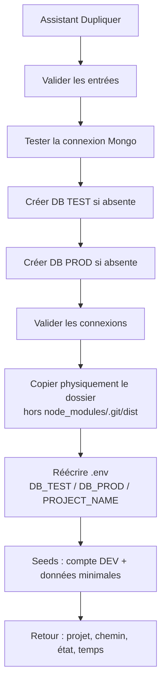
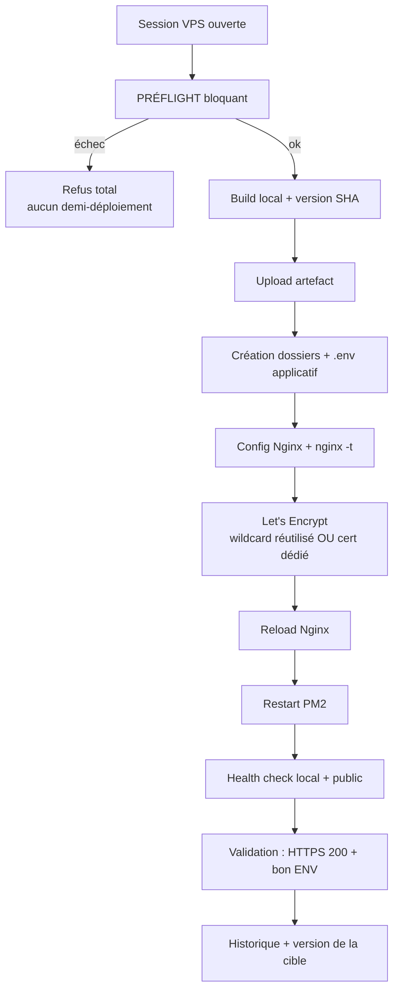

# RX-INDUSTRIAL-DEPLOYMENT — Moteur de duplication & déploiement industriel

> **Stockage persistant :** `backend/storage` est un lien vers le dossier
> partagé, il survit aux releases — voir
> [panelXvitrine/DOCUMENT_CONTRACTUEL.md](./panelXvitrine/DOCUMENT_CONTRACTUEL.md) §2.


Ce document décrit l'architecture, les flux, la gestion du mot de passe VPS, les
tests et les limites du moteur de déploiement. Il est le point d'entrée
documentaire du chantier `feat/industrial-deployment-engine`.

---

## 1. Philosophie

- **Aucun projet maître.** Chaque projet est autonome. « Dupliquer » clone LE
  projet actuellement ouvert — toutes les améliorations présentes aujourd'hui
  (moteur, UI, fonctionnalités) sont donc présentes dans le projet dupliqué.
- **Aucune synchronisation** avec un template n'existe.
- **Un seul moteur métier, UI-agnostic** (`backend/src/deployment/`). Le Manager
  et les routes API ne font que l'appeler. Demain, une CLI ou un panel
  multi-sites appelleront exactement les mêmes fonctions. Aucune logique React,
  aucune logique de déploiement dupliquée.

---

## 2. Architecture

```
backend/src/deployment/            ← MOTEUR (aucune dépendance UI / HTTP)
├── DeploymentEngine.js            Façade : point d'entrée unique
├── index.js                       Barrel export (routes / CLI / panel)
├── url.js                         Analyse d'URL complète → sous-domaine/domaine
├── dns.js                         Contrôles DNS (domaine client → VPS)
├── preflight.js                   Batterie de contrôles bloquants
├── build.js                       Build local + version (SHA git)
├── pipeline.js                    Pipeline UNIQUE (build→…→validation)
├── nginx.js                       Génération + application config Nginx
├── certbot.js                     Certificats (wildcard réutilisé / cert dédié)
├── pm2.js                         (Re)démarrage backend PM2
├── health.js                      Health check local + public
├── backup.js                      Backup / restore (Mongo + uploads + config)
├── duplication.js                 Duplication du projet (DB + dossier + .env + seed)
├── passwordVault.js               Coffre-fort RAM du mot de passe VPS
├── errors.js                      Erreurs typées (DeploymentError, PreflightError…)
└── transport/
    ├── Transport.js               Contrat d'exécution distante
    ├── SshTransport.js            Implémentation réelle (ssh2, import paresseux)
    └── FakeTransport.js           Simulateur (tests + dry-run)

backend/src/models/DeploymentTarget.model.js        Cible persistée + historique
backend/src/services/deploymentTarget.service.js    Persistance + versionnement
backend/src/controllers/deployment.controller.js    HTTP ↔ moteur (DEV only)
backend/src/routes/deployment.routes.js             Routes /api/deployment/*
backend/src/validators/deployment.validator.js      Schémas Zod

manager/src/pages/dev/DeploymentPage.tsx            UI (Cibles/Déployer/Dupliquer/Historique)
manager/src/lib/api.ts (api.deployment.*)           Client API
```

### Le Transport : clé de l'architecture

Tout le moteur (préflight, pipeline, nginx, certbot, pm2, health, backup) parle
**exclusivement** à l'interface `Transport`. Il ne connaît ni `ssh2`, ni le
réseau, ni le mot de passe VPS. Conséquences :

- **UI-agnostic** : aucune dépendance React / HTTP dans le moteur.
- **Testable sans VPS** : `FakeTransport` programme des réponses par motif de
  commande. Les 49 tests moteur tournent sans aucun serveur.
- **Réutilisable** : CLI, panel multi-sites, autre frontend — même moteur.

```
DeploymentEngine ──> Transport (interface)
                        ├── SshTransport   (prod : ssh2)
                        └── FakeTransport  (tests / dry-run)
```

---

## 3. Parcours de duplication (`§1` du cahier des charges)



- Entrées : nom projet, nom dossier, DB TEST, DB PROD, mail DEV, mot de passe DEV.
- La base PROD/TEST est créée par un marqueur idempotent (une base Mongo n'existe
  qu'avec ≥ 1 collection) ; le vrai bootstrap la remplira au premier démarrage.
- Le `.env` est réécrit par une **fonction pure** (`rewriteEnv`) : DB_TEST /
  DB_PROD / PROJECT_NAME remplacés, toutes les autres lignes conservées.
- Refus si le dossier cible existe déjà (jamais d'écrasement silencieux).

---

## 4. Parcours de déploiement (`§3`–`§6`)



**Pipeline unique** (`pipeline.js`), une seule implémentation, aucun doublon.
Chaque étape est chronométrée, émet un évènement `onStep` (alimente l'historique)
et, à la moindre erreur, **arrête** le pipeline en rapportant l'étape fautive.

---

## 5. Préflight (`§4`) — jamais de demi-déploiement

Contrôles exécutés (via le Transport) :

| Contrôle        | Bloquant ?                        |
|-----------------|-----------------------------------|
| Connexion/auth SSH | oui (arrêt immédiat si KO)      |
| Nginx installé  | oui                               |
| Node installé   | oui                               |
| PM2 installé    | oui                               |
| Certbot présent | oui si **domaine client** seulement |
| `nginx -t` valide | oui si Nginx présent            |
| Écriture racine | oui                               |
| Disque ≥ 500 Mo | oui                               |
| MongoDB accessible | non (avertissement)            |
| DNS (domaine client) | oui : résout **et** pointe vers le VPS |
| DNS (sous-domaine wildcard) | non : wildcard déjà en place |

Si un contrôle bloquant échoue → `PreflightError` → déploiement refusé.

---

## 6. Analyse d'URL & wildcard (`§4`–`§5`)

L'utilisateur renseigne **toujours l'URL complète**. Le moteur déduit tout.

- **Cas 1 — sous-domaine wildcard** : `https://demo-sbauto.ly-solution.com`
  L'hôte est un sous-domaine **direct** (un seul label) d'une base wildcard gérée
  (`ly-solution.com` par défaut, configurable via `DEPLOY_WILDCARD_BASES`).
  L'architecture officielle repose sur **un unique wildcard `*.ly-solution.com`**
  (DNS + certificat) configuré **une seule fois**. Conséquence : **aucun
  enregistrement DNS ni certificat à créer par site**. Le certificat
  `*.ly-solution.com` **existant** est réutilisé ; on crée seulement : config
  Nginx + reload. Le préflight vérifie que le certificat wildcard est présent sur
  le VPS (sinon il bloque avec un message clair).
- **Cas 2 — domaine client** : `https://sbauto06.fr`
  Certificat dédié Let's Encrypt (HTTP-01/webroot) ; le domaine doit **déjà**
  résoudre vers le VPS (vérifié au préflight, sinon blocage complet).

> `*.ly-solution.com` ne couvre qu'**un seul niveau** : `demo-sbauto.ly-solution.com`
> est couvert, mais `a.b.ly-solution.com` (deux labels) retombe en domaine client
> (cert dédié + contrôle DNS). Limite connue : le « domaine enregistrable » d'un
> domaine client est déduit par heuristique (2 derniers labels).

---

## 7. Changement de domaine (`§7`) & versions (`§8`)

- DEMO et PRODUCTION **coexistent** : ce sont deux cibles distinctes. Passer de
  l'une à l'autre = ajouter une cible `https://sbauto06.fr` puis « Déployer ».
  Rien n'est cassé, aucune hypothèse.
- Chaque cible mémorise : version déployée, date, état, historique. Le bouton
  « Déployer » pose simplement la version courante sur la cible choisie.

---

## 8. Gestion du mot de passe VPS (`§3`)

**Règle absolue : le mot de passe VPS n'est JAMAIS persisté.** Interdit dans
Mongo, `.env`, fichier, logs, cache, localStorage, sessionStorage.

- Le mot de passe transite une fois par `POST /api/deployment/vps-session`
  (HTTPS) et est stocké **uniquement en RAM du process backend**
  (`passwordVault.js`), indexé par un `sessionId` **opaque**. Le client ne reçoit
  que ce `sessionId`, jamais le secret.
- Le transport SSH lit le secret depuis le coffre-fort **au dernier moment**,
  puis :
  - **session éphémère** (défaut) : détruite en fin de déploiement
    (`closeIfEphemeral`) et par TTL court ;
  - **exception autorisée** — case « Conserver le mot de passe jusqu'à la
    fermeture du Manager » : gardé en RAM (jamais sur disque) jusqu'à
    déconnexion / fermeture / TTL long. Côté UI, le `sessionId` ne vit qu'en
    mémoire React (perdu au rafraîchissement) et la session serveur est fermée au
    démontage du composant.
- `describeSession` ne renvoie jamais le champ `password`.
- Vérifié par test : `describeSession ne divulgue jamais le mot de passe`,
  `closeIfEphemeral détruit une session éphémère`, `closeAll` efface tout.

---

## 9. Historique (`§9`) & Backup (`§10`)

- **Historique** (borné à 50 par cible) : date, version, utilisateur, cible,
  durée, succès/erreur, étapes. Persisté dans `DeploymentTarget.history`.
- **Backup** : `mongodump` de la base de la cible + uploads + configuration
  (nginx + `.env` applicatif, **jamais** le mot de passe VPS) + manifest de
  version → archive `.tar.gz` horodatée sur le VPS. `restore` inverse l'opération
  (`mongorestore --drop` + uploads).

---

## 10. API (DEV uniquement)

Toutes les routes exigent un JWT DEV (`authenticate` + `authorize(ROLES.DEV)`).

| Méthode | Route | Rôle |
|--------|-------|------|
| GET  | `/api/deployment/version` | Version courante (SHA) |
| POST | `/api/deployment/vps-session` | Ouvre une session VPS (RAM) |
| GET  | `/api/deployment/vps-session/:id` | Métadonnées (jamais le secret) |
| DELETE | `/api/deployment/vps-session/:id` | Détruit la session |
| GET  | `/api/deployment/targets` | Liste des cibles |
| POST | `/api/deployment/targets` | Crée une cible (URL complète) |
| DELETE | `/api/deployment/targets/:id` | Supprime une cible |
| GET  | `/api/deployment/targets/:id/backups` | Liste des archives |
| POST | `/api/deployment/preflight` | Préflight bloquant |
| POST | `/api/deployment/deploy/stream` | Déploiement — **le seul point d'entrée** (flux NDJSON) |
| POST | `/api/deployment/duplicate` | Duplication du projet |
| POST | `/api/deployment/duplicate/stream` | Duplication **en direct** (flux NDJSON) |
| POST | `/api/deployment/backup` | Sauvegarde |
| POST | `/api/deployment/restore` | Restauration |

> **Un seul déploiement, une seule porte.** `POST /api/deployment/deploy`
> (réponse unique) a été SUPPRIMÉE : elle appelait `engine.deploy()` sans créer
> de run durable, sans franchir la barrière de publication, sans journal
> forensique, et posait le verrou de destination à `null` — deux pipelines
> pouvaient donc s'exécuter sur la même destination. Elle n'avait plus aucun
> appelant. `deployment-entrypoints.test.js` échoue si une seconde route de
> déploiement réapparaît.

---

## 11. Tests réalisés (`§11`)

Runner autonome (style `promote.test.js`), sans framework, via `FakeTransport` et
`mongodb-memory-server` — **aucun VPS requis**.

- `backend/src/scripts/deployment-engine.test.js` — **71 checks** :
  analyse d'URL (wildcard vs domaine, **demo-sbauto.ly-solution.com** en sous-domaine
  wildcard *.ly-solution.com sans DNS, multi-label → domaine, port refusé, https
  forcé), coffre-fort VPS (ouverture, non-divulgation
  du secret, éphémère vs conservée, closeAll), **SshTransport** (instanciable, auth
  mot de passe, échec de connexion → rejet sans crash), préflight (VPS sain, SSH KO,
  Nginx absent bloquant, **adresse occupée par un autre site**), génération Nginx,
  pipeline complet (ordre des étapes, uploads, .env, health), pipeline en échec
  (health/cert), backup, façade (deploy injecté, préflight KO → PreflightError,
  refus sans session), **validation anti-injection shell** (dbName/remoteRoot/
  sshHost/sshUser/archive).
- `backend/src/scripts/duplication.test.js` — **33 checks** :
  validation, `rewriteEnv` (pure), `sanitizeFolderName`, connexion Mongo,
  `ensureDatabase` (création + idempotence), `copyProject` (denylist), duplication
  de bout en bout sur fixtures temporaires, émission ordonnée des phases (`onPhase`).

```
npm run test:deployment    # 49 passed
npm run test:duplication   # 33 passed
```

Côté Manager : `tsc -b --noEmit` (typecheck) et `vite build` (bundle) passent
sans erreur.

Les deux suites sont intégrées à `npm test`. Le typecheck du Manager
(`tsc -b --noEmit`) passe sans erreur.

---

## 12bis. Expérience utilisateur (RX-DEPLOYMENT-UX)

Le module Manager n'est pas un outil DevOps : c'est un logiciel métier « Publier
mon site ». Un utilisateur non technique n'a JAMAIS à connaître SSH, Nginx, PM2,
Let's Encrypt, Mongo, DNS, build ou Certbot.

- **Accueil** (`deployment/Landing.tsx`) : hero rassurant + deux grandes cartes
  (« Dupliquer un projet », « Déployer un site ») + entrées secondaires (Mes
  sites, Historique).
- **Assistants** (`ui.tsx > WizardShell`) : barre de progression, étapes
  numérotées, Précédent/Suivant, une seule décision par écran.
  - Duplication : Projet → Bases → Compte → Résumé → Création (progression en
    direct) → Succès.
  - Déploiement : Destination → Serveur → Résumé → Préflight → Publication →
    Succès.
- **Préflight comme expérience** (`PreflightExperience.tsx`) : les ~11 contrôles
  techniques sont projetés (`friendly.ts > groupPreflight`) sur 5 étapes lisibles
  qui apparaissent progressivement — Connexion au serveur, Configuration du
  domaine, Préparation du site, Sécurisation HTTPS, Vérification finale. Le détail
  technique reste dans « Voir les détails », replié.
- **Publication en direct** (`DeploymentFollowUp.tsx`) : grande progression
  radiale + phases animées, alimentées par le **run persisté** — la vue observe
  `GET /deployment/runs/:id/observe` et rend l'instantané du backend. Pas de
  fausse animation, et **aucune accumulation d'étapes côté React**.
  `DeployRunning.tsx` n'est plus qu'un lanceur : il obtient le `runId`, détache
  le POST, puis délègue le suivi. Voir
  [ARCHITECTURE.md](ARCHITECTURE.md#couche-déploiement--le-travail-appartient-au-backend).
- **Succès** (`SuccessScreen.tsx`) : illustration, confettis légers (désactivés
  si `prefers-reduced-motion`), infos utiles (adresse, HTTPS actif, version,
  date, durée), « Ouvrir le site », « Déployer une nouvelle version ».
- **Erreurs** (`ErrorPanel.tsx` + `friendly.ts > humanizeError`) : jamais de
  stack ni de commande Linux — titre rassurant, cause, solution, « Réessayer »,
  et « Voir les détails techniques » repliés.
- **Mes sites** (`TargetsGrid.tsx`) : grandes cartes (état, version, dernier
  déploiement, « Déployer ici »). **Historique** (`HistoryTimeline.tsx`) :
  timeline avec rapport par déploiement.
- **Direction artistique** : cartes arrondies, ombres discrètes, beaucoup
  d'espace, animations fluides (framer-motion), illustrations SVG maison
  (`illustrations.tsx`, thème-aware), icônes Lucide — **aucun emoji**.
- **Accessibilité** : navigation clavier, focus visibles (`focus-visible:ring`),
  régions `aria-live` sur les progressions, `prefers-reduced-motion` respecté,
  responsive desktop/laptop/tablette.

Le mot de passe VPS reste **en mémoire vive uniquement** côté client (jamais
localStorage/sessionStorage) : la session est fermée à la déconnexion et au
démontage du module.

**Connexion serveur simplifiée** : le parcours courant ne demande que **le
serveur (ou son IP, préconfigurée à la création) et le mot de passe**. L'utilisateur
du serveur n'apparaît plus dans le flux standard — il est **préconfiguré sur
« root »** (champ `sshUser` de la destination) et reste éditable dans une section
« Options avancées » réservée aux cas particuliers. Un utilisateur n'a donc jamais
à savoir ce qu'est un utilisateur SSH pour publier son site.

## 12. Limites restantes / travaux futurs

- **Validation sur VPS réel** : le pipeline (nginx/certbot/pm2/health) et le
  backup sont exécutés à travers le Transport et testés de bout en bout avec
  `FakeTransport`, mais **n'ont pas été exécutés contre un vrai serveur** dans ce
  chantier (aucun VPS ni identifiants fournis). Le `SshTransport` réel s'appuie
  sur `ssh2` (ajouté aux dépendances backend) : lancer `npm install` côté backend
  avant un déploiement réel.
- **Streaming des logs** : le déploiement renvoie aujourd'hui le résultat complet
  (étapes + durées) en une réponse. Un flux temps réel (SSE/WebSocket) pour la
  progression live est un ajout naturel (le moteur émet déjà `onStep`).
- **Domaine enregistrable** : heuristique 2-labels (pas de Public Suffix List
  complète). Suffisant pour `.fr`, `.com`, sous-domaines wildcard ; à enrichir
  pour les suffixes composés (`.co.uk`…).
- **Duplication** : la copie exclut `node_modules`, `.git`, `dist`, `coverage`,
  `migration-reports` (régénérés). Le `.env` source (secrets) n'est pas copié
  tel quel : il est réécrit à partir du `.env` existant ou du `.env.example`.
```

---

## Deployment Phase Registry

> **Ne jamais ajouter une étape directement dans `friendly.ts`, la checklist du
> Manager ou le générateur de rapport.** Une étape déclarée là ne serait jamais
> émise par le moteur : elle resterait « en attente » sur un déploiement
> pourtant réussi, et la barre de progression compterait une étape fantôme.
> C'est arrivé (`dns.manager` renommé en `dns.apps`), et une garde
> d'architecture (`engine-governance.test.js`) l'interdit désormais.

### Où une étape est définie

Un seul fichier :

```
backend/src/deployment-engine/steps.js
```

Chaque entrée porte : `id`, `order`, `label`, `precheckLabel?`, `icon`, `group`,
`modes`, `required`, `blocking`, `visible`, `conditional?`,
`publicationBoundary?`. Tout en dérive — l'ordre, les libellés, les DEUX
checklists live (déploiement et préflight), la validation du flux, le rapport et
les gardes.

Ce fichier ne décrit **pas** les diagnostics. `reasonCode`, `failingFile`,
`candidatePath`, `certbotVersion`, `restoreSucceeded` sont des données
d'exécution : elles voyagent dans les détails d'un événement, jamais comme des
pseudo-étapes.

### Comment l'émettre

Le moteur passe par le traceur, qui refuse au point d'émission une étape hors
registre, un statut hors vocabulaire ou une transition impossible :

```js
emitStep('nginx.configure', 'running');
// … le travail …
emitStep('nginx.configure', 'ok');      // ou 'warning' | 'error' | 'skipped'
```

États possibles, et rien d'autre :

```
pending → running → ok | warning | error | cancelled
pending → skipped
pending → warning          (exception documentée : domaine non géré)
error   → cancelled        (interruption pendant la propagation d'un échec)
```

`warning` n'est pas un `ok` timide : une vérification DNS peut aboutir en
signalant une propagation incomplète. `skipped` n'est pas `ok` non plus — une
étape qui n'avait pas lieu d'être n'a rien réussi.

Le pipeline distant nomme ses gestes par ce qu'ils **font** (`dirs`, `certbot`,
`reload`) ; `RAW_TO_CANONICAL` les traduit. Plusieurs gestes peuvent composer une
étape visible : elle démarre au premier et n'est close qu'au **dernier**
(`isLastRawOfStep`).

### Étapes conditionnelles

`required: false` + `conditional: true` déclare une étape qui peut légitimement
ne pas avoir lieu — les cinq étapes DNS, sans fournisseur configuré. Elles sont
alors `skipped` (ou `warning` avec leur motif), jamais `ok`, et ne sont jamais
exigées à la conclusion.

### Modes d'exécution

`modes` déclare si l'étape appartient au déploiement, au préflight, ou aux deux.
Un préflight exécute le prologue puis s'arrête : c'est le même moteur sur un
sous-ensemble **déclaré**. C'est ce qui permet à l'interface de dériver deux
checklists d'une seule définition, au lieu d'en recopier une seconde.

`precheckLabel` couvre le seul cas où le libellé doit différer : en préflight,
« Préparation du déploiement » serait mensonger — rien n'est déployé.

### Comment elle apparaît dans l'interface

Automatiquement. Le Manager demande le contrat (`GET /deployment/phases`) et
`deploymentChecklist.ts` en dérive la checklist du mode courant. Si le contrat
est indisponible, la checklist est **vide et l'écran le dit** : aucun repli figé
n'est embarqué côté interface — ce serait recréer la liste parallèle qu'on vient
de supprimer, avec la garantie qu'elle dérive.

### Comment elle apparaît dans le rapport

`result.checklist` dérive du registre (définition) et du traceur (état). Une
étape `required` restée en attente à la conclusion fait **échouer** le
déploiement (`DEPLOYMENT_PHASE_MISSING`) : il devient impossible d'afficher un
succès sur un travail partiel.

### Rapports historiques

Un run persiste ses propres `steps` avec leur `id`, `label` et `order` : un
rapport ancien reste lisible tel qu'il a été écrit, même si le registre évolue
ensuite. Aucun adaptateur n'est nécessaire, et aucune seconde source de vérité
runtime n'est conservée pour eux. Un `registryVersion` n'a donc pas été ajouté —
le run porte déjà la version applicative et l'empreinte de commit, et le rapport
est auto-descriptif.

---

## Remote Command Contract

> **Ne jamais appeler `transport.exec()` directement depuis le chemin critique.**
> Une garde d'architecture (`engine-governance.test.js`) l'interdit dans
> `pipeline.js`, `nginx.js` et `certbot.js`.

### Le défaut que ce contrat ferme

Le moteur lançait ses commandes distantes et, sur le chemin critique, n'en
lisait jamais le code de sortie. `npm ci --omit=dev` pouvait retourner 1 :
l'étape passait au vert, et le problème n'apparaissait qu'au contrôle de santé —
après publication de la release. Pire, le transport SSH rendait
`code: exitCode ?? 0` : une **connexion coupée** était rapportée comme un
**succès**.

### La primitive

```js
import { COMMAND_CLASS, TIMEOUTS, runRemoteCommand, strictShell } from './remoteCommand.js';

await runRemoteCommand(transport, {
  commandId: 'dependencies.npm_ci',      // stable, non sensible — OBLIGATOIRE
  command: strictShell(`cd ${dir}; npm ci --omit=dev`),
  commandClass: COMMAND_CLASS.CRITICAL,  // OBLIGATOIRE
  timeoutMs: TIMEOUTS.INSTALL,
  step: 'dirs',
});
```

Résultat normalisé : `{ commandId, commandClass, exitCode, signal, stdout,
stderr, stdoutTail, stderrTail, durationMs, timedOut, connectionLost, ok }`.

### Les classes

| Classe | Échec → | Exemples |
| --- | --- | --- |
| `CRITICAL` | **lève** une erreur typée, phase ERROR, pipeline arrêté | `npm ci`, bascule de release, `nginx -t` install, reload, webroot TLS |
| `PROBE` | **rend** son verdict — la question a une réponse | `test -f cert`, `nginx -t`, `certbot certonly` (son message EST le diagnostic) |
| `BEST_EFFORT` | rend `ok: false` + `error`, journalisé | opérations facultatives |
| `CLEANUP` | rend l'échec sans remplacer le diagnostic | désactivation d'une conf invalide |
| `ROLLBACK` | rend l'échec — l'erreur PRIMAIRE reste la première à lire | restauration |

La classe est **obligatoire** : une commande sans classe est refusée. Un défaut
à `CRITICAL` ferait échouer des sondes légitimes ; un défaut à `BEST_EFFORT`
rendrait silencieux tout ce qu'on oublie de classer — c'est exactement la
situation réparée.

### Codes d'erreur

```
REMOTE_COMMAND_FAILED           code de sortie non nul
REMOTE_COMMAND_TIMEOUT          délai dépassé
REMOTE_COMMAND_CONNECTION_LOST  transport en échec, ou code de sortie ABSENT
REMOTE_COMMAND_SIGNALLED        process tué par signal
```

Un code de sortie **absent** n'est jamais un succès.

### Commandes composées

`cmd1; cmd2` rend le code du **dernier** ; `a | b` celui de **b**. Un `tar` qui
échoue en amont d'un pipe disparaît derrière un `head` satisfait. Toute commande
critique composée passe donc par `strictShell()` (`set -euo pipefail`), et la
gouvernance le vérifie.

### Délais

Politique centrale (`TIMEOUTS`) : `QUICK` 30 s · `FILESYSTEM` / `SERVICE` 60 s ·
`CERTBOT` 180 s · `INSTALL` 300 s · `BUILD` 600 s · `HEALTH` 30 s. Aucune
commande ne peut bloquer indéfiniment.

### Identifiants de commande

Le rapport nomme `dependencies.npm_ci`, jamais la ligne shell — qui porte des
chemins, parfois des hôtes. Identifiants en service : `release.prepare_dirs`,
`release.swap`, `release.link_shared`, `release.shared_dirs`,
`dependencies.npm_ci`, `nginx.install_config`, `nginx.enable_site`,
`nginx.test`, `nginx.reload`, `nginx.disable_invalid_site`,
`tls.probe_existing_cert`, `tls.prepare_webroot`, `tls.certbot_certonly`.

### Caviardage

Appliqué **avant** conservation, jamais après : URI Mongo, `*_SECRET`/`*_TOKEN`/
`*_PASSWORD`/`*_API_KEY`, clés privées PEM, en-têtes `Authorization`, jetons JWT.
Les sorties sont bornées à 2 000 caractères, **fin conservée** — c'est elle qui
porte l'erreur.

### Couverture complète du contrat

Depuis le lot de complétion, **aucun code applicatif du moteur n'appelle
`transport.exec` directement**. Une garde d'architecture parcourt tout
`deployment-engine/` et n'exempte que `remoteCommand.js` (l'implémentation du
contrat) et `transport/` (l'implémentation du transport). Il n'existe pas de
liste blanche par fichier : elle grandirait chaque fois qu'on manque de temps.

Classification par module :

| Module | Commandes | Classes |
| --- | --- | --- |
| `pipeline.js` | 5 | CRITICAL |
| `nginx.js` | 5 | CRITICAL ×3, PROBE, CLEANUP |
| `certbot.js` | 3 | CRITICAL, PROBE ×2 |
| `uploads.js` | 2 | CRITICAL (inventaire), PROBE (copie → erreur métier) |
| `pm2.js` | 4 | PROBE ×3, BEST_EFFORT (`pm2 save`) |
| `health.js` | 8 | PROBE (le `\|\| echo` EST le contrat) |
| `preflight.js` | 7 | PROBE |
| `ports.js` | 3 | PROBE |
| `backup.js` | 15 | CRITICAL ×6, BEST_EFFORT ×4, CLEANUP ×2, PROBE ×2 |
| `deprovision.js` | 25 | CRITICAL ×7, BEST_EFFORT ×3, ROLLBACK, PROBE ×14 |
| `rollback.js` | 4 | ROLLBACK (échange), PROBE ×3 |

**Une sonde tolère un code de sortie non nul — jamais une impossibilité
d'exécuter.** `test -f` qui rend 1 dit « non » ; une connexion refusée ne dit
rien. Le contrat lève dans le second cas, y compris pour une sonde, et conserve
l'erreur d'origine dans `cause` — c'est elle qui nomme la panne
(« authentification refusée », « ECONNREFUSED ») et permet au préflight de
distinguer un mot de passe d'un pare-feu.
